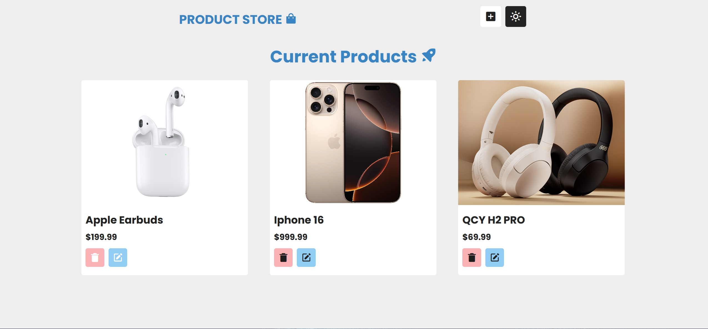

# Product Management Application

Welcome to the **Product Management Application**! This web-based project allows users to add, edit, and delete products dynamically, with persistent data storage using `localStorage`.

> I came across a similar project on YouTube that was built using React. Since I haven’t learned React yet, I decided to challenge myself by building it entirely with Vanilla JavaScript.


## Features

- **Add Products:** Create new products with a name, image URL, and price.
- **Edit Products:** Modify existing product details.
- **Delete Products:** Remove products from the list.
- **Persistent Storage:** Uses `localStorage` to save products, ensuring data is retained even after page reloads.
- **Interactive UI:** Provides real-time feedback with success/error messages for user actions.

---

## Tech Stack

- **HTML5**: Markup structure.
- **CSS3**: Styling for a responsive and visually appealing UI.
- **JavaScript**: Core functionality, including:
  - DOM manipulation
  - Event handling
  - `localStorage` for data persistence

---

## How to Run

1. Clone the repository:
   ```bash
   git clone https://github.com/theawmirs/product-management-app.git
   ```
2. Open the project folder:
   ```bash
   cd product-management-app
   ```
3. Open `index.html` in any modern browser.

---

## Folder Structure

```plaintext
product-management-app/
├── css/
│   ├── styles.css       # Main stylesheet
│   ├── normalize.css    # Reset styles
├── script/
│   └── app.js           # JavaScript functionality
├── index.html           # Main HTML file
└── README.md            # Project details
```

---

## Screenshots

1. **Dark Mode**  
     

2. **Light Mode**  
     

3. **Add Product Section**  
   

---

## What I Learned

- Using `localStorage` for persistent data management.
- Handling events dynamically with JavaScript.
- Validating user inputs and managing error/success states.
- Structuring projects for scalability.

---

## Contributing

Feel free to fork the repository and submit pull requests. All contributions are welcome!
```
